```{r setup, include=FALSE}
knitr::opts_chunk$set(echo = FALSE, 
                      verbose = FALSE,
                      message = FALSE, 
                      warning = FALSE)
```

```{r}
require(knitr)
#require(rbbt)
require(dplyr)
require(flextable)
require(readxl)
require(kableExtra)
require(gt)
library(downloadthis)
# This will automatically update the BIB file:
#keys = rbbt::bbt_detect_citations('Trial_Specs.qmd')
#bbt_ignore = keys[grepl("fig-|tbl-|eq-|sec-", keys)]
#rbbt::bbt_update_bib(path_rmd = 'Trial_Specs.qmd', 
#                     ignore = bbt_ignore, overwrite = T, translator = "bibtex")
```

## Introduction

The tropical tunas (TT) fishery, under the management of the International Commission for the Conservation of Atlantic Tuna (ICCAT), is undergoing a management strategy evaluation (MSE) process. This fishery mainly target bigeye (BET), skipjack (SKJ), and yellowfin (YFT) tunas.

::: {.callout-note icon="false"}
## Management strategy evaluation

Process used in fisheries management to simulate and assess the performance of different management strategies under varying conditions and uncertainties (@fig-mse).
:::

There are three main components in an MSE process:

-   **Operating models (OMs)**: a collection of mathematical/statistical models that describe alternative hypotheses of the historical fishery dynamics and specifications for simulating the collection of data and implementation of management measures in the future;
-   **Candidate management procedures (CMPs)**: a set of proposed algorithms that generate management recommendations from fishery data and will be evaluated in the MSE;
-   **Performance indicators (PIs)**: statistics used to quantitatively evaluate the CMPs against specified management objectives.

The OMs, CMPs, and PIs are developed as a collaborative effort between scientists, decision-makers, and other stakeholders in the fishery.

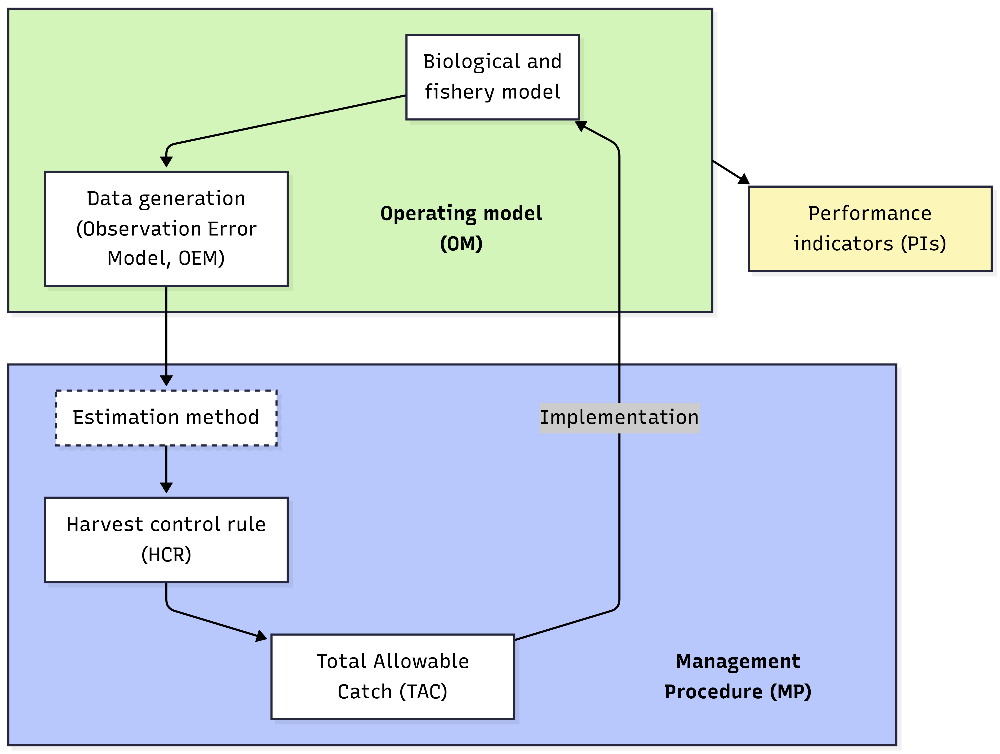{#fig-mse width="75%"}

### About this document

This document describes the specifications for the OMs, CMPs, and PIs that have been proposed and developed for the TT fishery. It is a living document and will be continued to be updated so that it reflects the current state of the multi-stock TT MSE process. Members of the Tropical Tuna Species Group (TTSG) are encouraged to provide feedback, comments, or edits to any part of this document.

The document is written using the [Quarto](https://quarto.org/) format and can edited in any text editor. The source document is available on the [MSE GitHub repository](https://github.com/ICCAT/multitro-mse). TTSG members can make edits to the document either directly in the online repository or by cloning the repository and submitting pull requests with their edits. Alternatively, they can email questions or comments to [the authors](mailto:aurtizberea@azti.es). The former approach has the advantage that all comments, questions, and edits are immediately visible to all members of the TTSG. The [Discussions feature](https://docs.github.com/en/discussions/quickstart#creating-a-new-discussion) on the Github repository can also be used to post questions, comments, or points for discussion related to any aspect of this document or the MSE process in general.

This document is available at the [TT MSE homepage](https://iccat.github.io/multitro-mse/).

## MSE framework

The R software has been used to developed the MSE code for the TT fishery. All code is open-source and can be found on the [MSE GitHub repository](https://github.com/ICCAT/multitro-mse). 

The code developed for the TT MSE uses the [FLBEIA](https://github.com/flr/FLBEIA) framework. FLBEIA [@garciaFLBEIASimulationModel2017] is an R package that has been developed for conducting bio-economic evaluation of fisheries management strategies. The software allows the bio-economic evaluation of a wide range of management strategies in a great variety of case studies such as multi-stock, multi-fleet, stochastic and seasonal configurations. FLBEIA is built using FLR libraries. [FLR](https://flrproject.org/) is a collaborative project oriented to develop quantitative fisheries management tools.

## Stock assessment

In this section, we describe the main aspects of the last stock assessment models for BET, SKJ, and YFT, which were then used to condition the OMs. These assessments use the areas-as-fleets approach, which aims to account for the regional differences in fishing behavior and selectivity using a single-area model configuration [@waterhouseUsingAreasasfleetsSelectivity2014]. These regions are shown in @fig-ssmap.

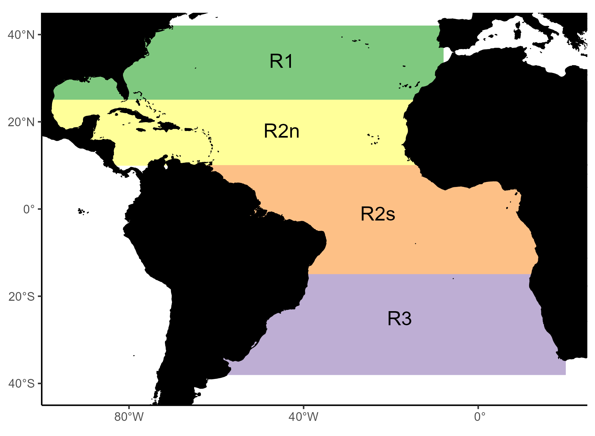{#fig-ssmap width="80%"}

### Bigeye

The last stock assessment was conducted in 2021 [@iccatReport2021Bigeye2021] using the Stock Synthesis (SS3) platform [@methotStockSynthesisBiological2013]. The data used in the BET assessment and the structure and assumptions of the assessment model are summarized in the sections below.

```{r}
#| label: tbl-bet-fleet
#| tbl-cap: Fishing fleets included the BET stock assessment. See @fig-ssmap for the definition of regions. The last column indicates if the fleet had an associated index of abundance (catch-per-unit-effort, CPUE).
my_tab = readRDS('../tables/BET/FleetInfo.rds')
my_tab |> gt() |>
  cols_label(Fleet = "Fleet code",
             CPUE = "CPUE included?") |>
  tab_style(style = list(cell_text(weight = "bold")),
            locations = cells_column_labels())
```

#### Data

The period covered was from 1950 to 2019. The assessment mainly used landings data from longline (LL), purse seine (PS), and baitboat (BB) fleets, with a total of 22 fleets included in the model (@tbl-bet-fleet and @fig-bet-data). There were two indices of abundance: one derived from echosounder information from buoys and one derived from the LL Japan in region 2 (@fig-bet-cpue). The catchability coefficients for the CPUE indices were assumed to be time-invariant.

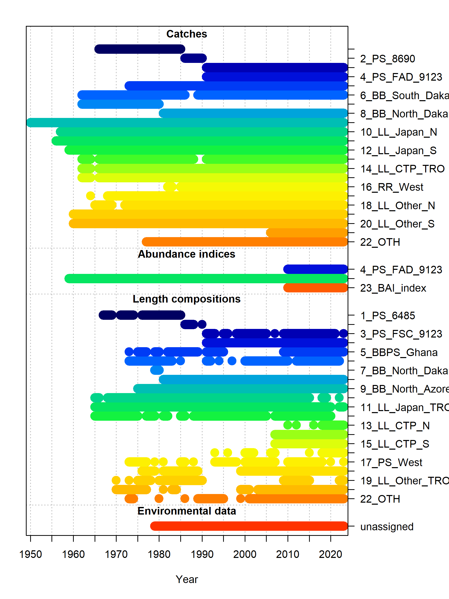{#fig-bet-data width="80%"}

Length composition data for most fleets (excluding handline Brazil) were included in the model (@fig-bet-data). The effective sample size (ESS) for the length composition data was established by adjusting ESS until unity was reached between modeled ESS and the Francis suggested sample size [@francisDataWeightingStatistical2011]. 

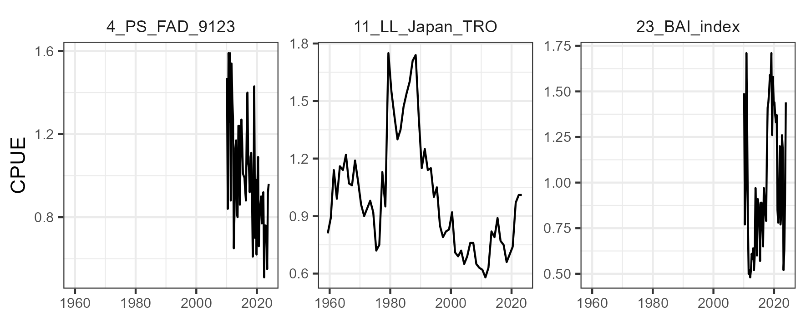{#fig-bet-cpue}

#### Model structure

The model was configured yearly with four seasons per year, one sex, one area, and a total of 11 age groups (0 to 10+). The spawning timing was January 1st.

#### Biological Parameters

Natural mortality was age-specific and parametrized following @thenEvaluatingPredictivePerformance2015, assuming a maximum age of 17, 20, or 25 years. Maturity-at-age was knife-edge, with 50% at age-3 and 100% thereafter. Fecundity was proportional to body weight. Growth was parametrized following the Richards curve [@richardsFlexibleGrowthFunction1959]. Variability of lengths-at-age was assumed to be a function of mean length-at-age. @fig-bet-biology shows a summary of the biological parametrization.

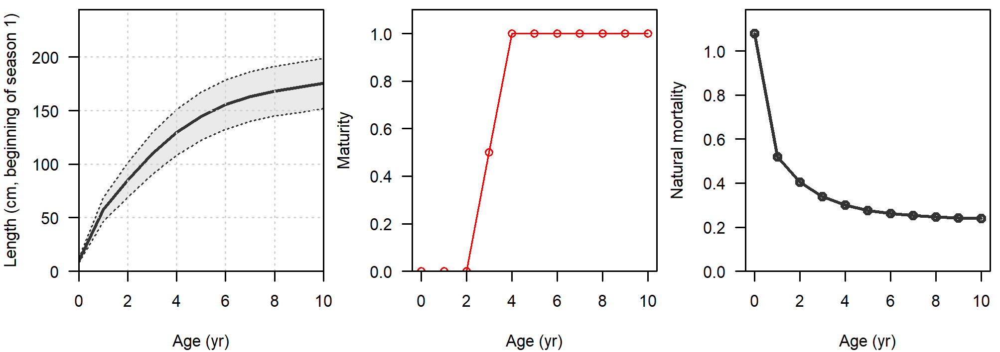{#fig-bet-biology}

#### Stock-Recruitment

Expected recruitment to age-0 was calculated from the total spawning stock biomass using the Beverton-Holt stock-recruit function. Recruitment settlement was assumed to occur at month 1, 4, 7, and 10 (i.e., start of every season). The standard error for the log-normally distributed recruitment deviations (sigmaR) was fixed to 0.2, 0.4, or 0.6. Steepness was fixed to values of 0.7, 0.8, or 0.9.

#### Selectivity

Selectivity was modelled as a function of length and was assumed to be time-invariant. Dome-shaped selectivity was allowed for several LL and BB fleets, while cubic splices were used for PS and some BB fleets.

### Skipjack

The last stock assessment was conducted in 2022 [@iccatReport2022Skipjack2022] using the SS3 platform. The data used in the SKJ assessment and the structure and assumptions of the assessment model are summarized in the sections below.

```{r}
#| label: tbl-skj-fleet
#| tbl-cap: Fishing fleets included the SKJ stock assessment. See @fig-ssmap for the definition of regions. The last column indicates if the fleet had an associated index of abundance (CPUE).
my_tab = readRDS('../tables/SKJ/FleetInfo.rds')
my_tab |> gt() |>
  cols_label(Fleet = "Fleet code",
             CPUE = "CPUE included?") |>
  tab_style(style = list(cell_text(weight = "bold")),
            locations = cells_column_labels())
```

#### Data

The period covered was from 1950 to 2020. The assessment mainly used landings data from LL, PS, and BB fleets, with a total of 11 fleets included in the model (@tbl-skj-fleet and @fig-skj-data). There were a total of three indices of abundance available for the assessment: one derived from echosounder information from buoys ($11\_Acoustic\_Buoy$), one derived from PS operating on fishing aggregating devices catch and effort information ($4\_PS\_FAD\_91$), and one derived from the BB in region 1 (@fig-skj-cpue). The $4\_PS\_FAD\_91$ and $11\_Acoustic\_Buoy$ indices were not included together in a model run. The catchability coefficients for the CPUE indices were assumed to be time-invariant.

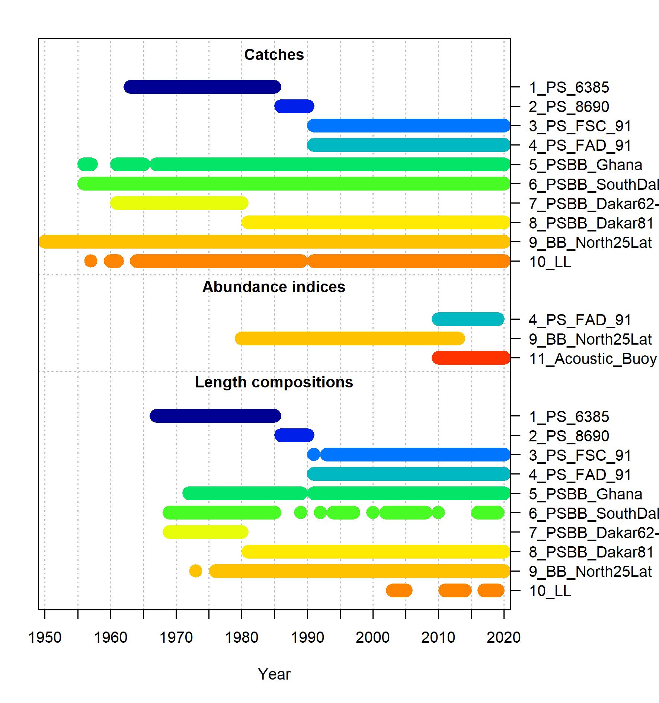{#fig-skj-data width="80%"}

Length composition data for all fleets were included in the model (@fig-skj-data). The ESS for the length composition data was established by adjusting ESS until unity was reached between modeled ESS and the Francis suggested sample size [@francisDataWeightingStatistical2011]. 

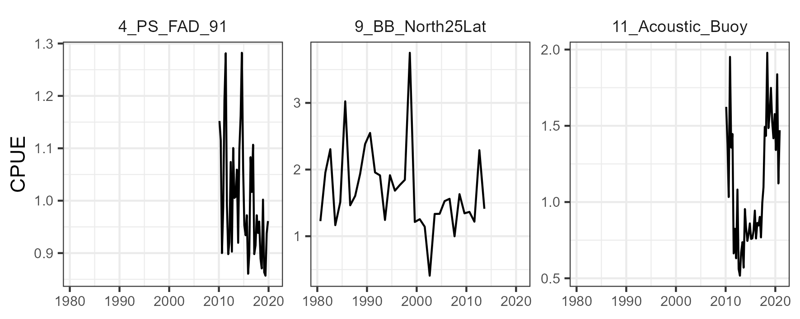{#fig-skj-cpue}

#### Model structure

The model was configured yearly with four seasons per year, one sex, one area, and a total of 7 age groups (0 to 6+). The spawning timing was January 1st.

#### Biological Parameters

Natural mortality (M) was age-specific and parametrized following @lorenzenRelationshipBodyWeight1996, with a reference M equal to 0.55 for age 6. Maturity-at-length followed a logistic function. Fecundity was proportional to body weight. Growth was parametrized following the von Bertalanffy curve [@schnuteVersatileGrowthModel1981] with three different set of parameters, which also impacted the derived M-at-age values. Variability of lengths-at-age was assumed to be a function of mean length-at-age. @fig-skj-biology shows a summary of the biological parametrization.

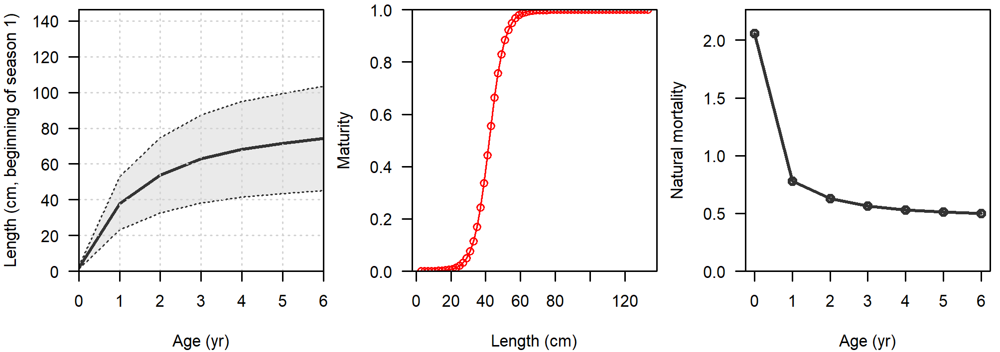{#fig-skj-biology}

#### Stock-Recruitment

Expected recruitment to age-0 was calculated from the total spawning stock biomass using the Beverton-Holt stock-recruit function. Recruitment settlement was assumed to occur at month 1, 4, 7, and 10 (i.e., start of every season). sigmaR was fixed to 0.4 and steepness was fixed to values of 0.7, 0.8, or 0.9.

#### Selectivity

Selectivity was modelled as a function of length and was assumed to be time-invariant. Dome-shaped selectivity was allowed for most fleets, while a logistic shape was modelled for the LL fleet.

### Yellowfin

The last stock assessment was conducted in 2024 [@iccatReport2024ICCAT2024] using the SS3 platform. The data used in the YFT assessment and the structure and assumptions of the assessment model are summarized in the sections below.

```{r}
#| label: tbl-yft-fleet
#| tbl-cap: Fishing fleets included the YFT stock assessment. See @fig-ssmap for the definition of regions. The last column indicates if the fleet had an associated index of abundance (catch-per-unit-effort, CPUE).
my_tab = readRDS('../tables/YFT/FleetInfo.rds')
my_tab |> gt() |>
  cols_label(Fleet = "Fleet code",
             CPUE = "CPUE included?") |>
  tab_style(style = list(cell_text(weight = "bold")),
            locations = cells_column_labels())
```

#### Data

The period covered was from 1950 to 2022. The assessment mainly used landings data from LL, PS, and baitboat BB fleets, with a total of 19 fleets included in the model (@tbl-yft-fleet and @fig-yft-data). There were a total of five indices of abundance available for the assessment: one derived from PS operating on floating objects catch and effort data ($4\_PS\_ESFR\_FOB\_9122$), one derived from PS operating on free schools catch and effort data ($4\_PS\_ESFR\_FS\_9122$), and three indices derived from LL for region 1, 2, and 3 (@fig-yft-cpue). The catchability coefficients for the CPUE indices were assumed to be time-invariant.

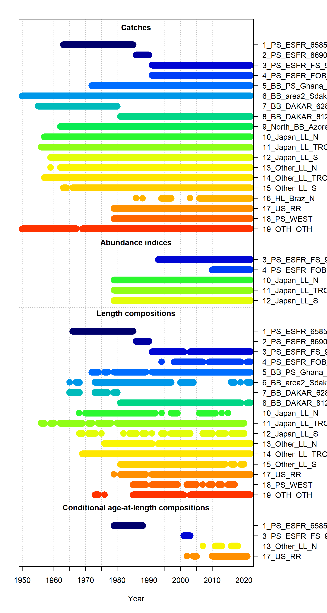{#fig-yft-data width="80%"}

Length composition data for most fleets were included in the model (@fig-yft-data). The ESS for the length composition data was established by adjusting ESS until unity was reached between modeled ESS and the Francis suggested sample size [@francisDataWeightingStatistical2011]. Conditional age-at-length (CAAL) data was also included for four fleets (@fig-yft-data).

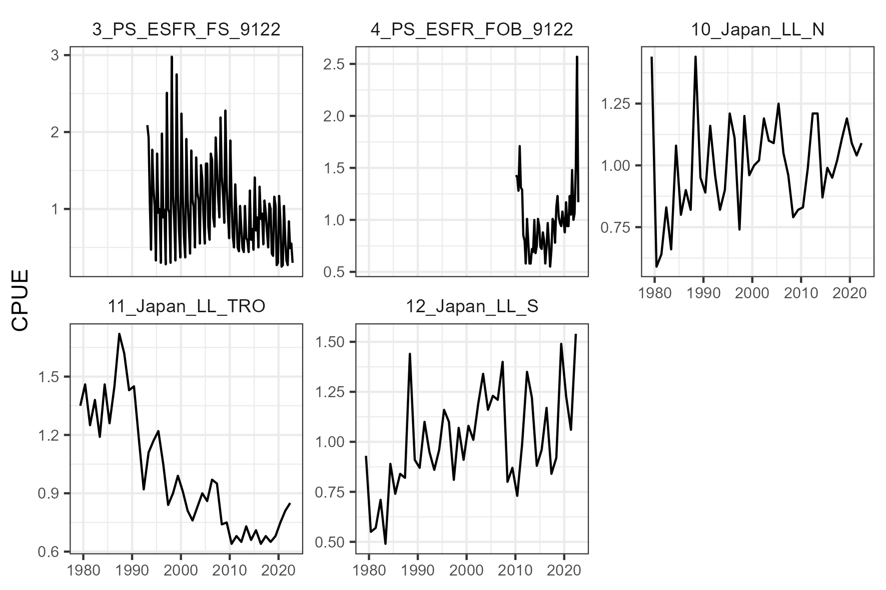{#fig-yft-cpue}

#### Model structure

The model was configured yearly with four seasons per year, one sex, one area, and a total of 11 age groups (0 to 10+). The spawning timing was January 1st.

#### Biological Parameters

Natural mortality (M) was age-specific and parametrized following @lorenzenRelationshipBodyWeight1996, with a reference M ($M_{ref}$) equal to 0.3 for age 7 assuming a maximum age of 18 years [@hamelDevelopmentConsiderationsApplication2022]. Alternative $M_{ref}$ values of 0.25 and 0.35 were also tested. Maturity-at-length followed a logistic function. Fecundity was proportional to body weight. Growth was parametrized following the Richards curve [@richardsFlexibleGrowthFunction1959]. Variability of lengths-at-age was assumed to be a function of mean length-at-age. @fig-yft-biology shows a summary of the biological parametrization.

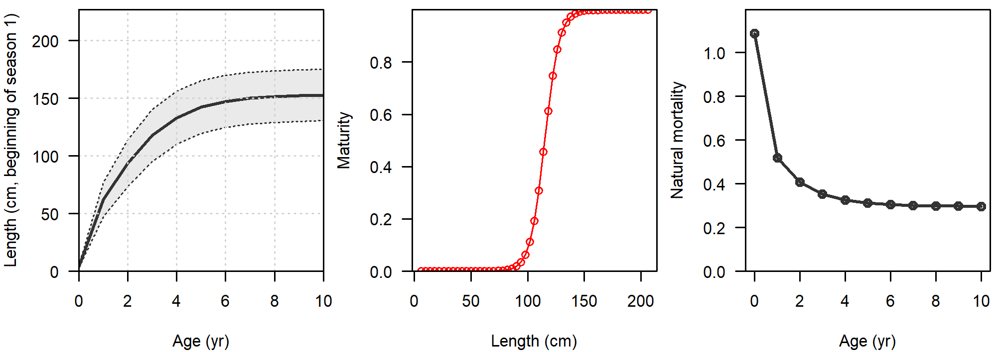{#fig-yft-biology}

#### Stock-Recruitment

Expected recruitment to age-0 was calculated from the total spawning stock biomass using the Beverton-Holt stock-recruit function with flat-top beyong unfished biomass. Recruitment settlement was assumed to occur at month 1, 4, 7, and 10 (i.e., start of every season). sigmaR was freely estimated and steepness was fixed to 0.7, 0.8, or 0.9.

#### Selectivity

Selectivity was modelled as a function of length and was assumed to be time-invariant. Dome-shaped selectivity was modelled for most LL and BB fleet, while cubic splines was modelled for the PS fleets.

## Operating Models

### Reference OMs

The TTSG developed a set of OMs considering the axes of uncertainty evaluated in the stock assessment for each stock (@tbl-unc-grid). A factorial combination of these axes produced a total of 4374 models. Due to the large amoung of combinations, we randomly selected 500 models that were used as the Reference OMs in the MSE.

```{r}
#| label: tbl-unc-grid
#| tbl-cap: Description of the axes of uncertainty for each stock.
my_tab = read_excel('../tables/UncertaintyGrid.xlsx')
my_tab |> gt(rowname_col = "Axis", groupname_col  = "Stock") |>
  tab_style(style = list(cell_text(weight = "bold")),
            locations = cells_column_labels())
```

### Robustness OMs

The TT MSE evaluated the impacts of potential decrease in the mean recruitment level in future years. To do so, the $R_0$ parameter of the Beverton-Holt relationship decreased by 20% in the simulation period (@fig-time) from the estimated values in the Reference OMs for the three stocks. This set of runs with smaller $R_0$ is our Robustness OMs.

Robustness scenario are currently under development.

### Validation

#### Summary Report

Summary reports summarize the estimated parameters, the calculated biological reference points, and the estimated stock status relative to those reference points per stock (@tbl-sum-rep).

```{r}
#| label: tbl-sum-rep
#| tbl-cap: OM summary reports.
stock_vec = c('Bigeye', 'Skipjack', 'Yellowfin')
my_tab = data.frame(Stock = stock_vec, report = 'See Summary report')
url_links = paste0("om_report/om_report_", tolower(stock_vec), ".html")
my_tab$report = url_links
my_tab |> gt() |> fmt_url(columns = 'report', label = 'See Summary report',
                          color = 'blue')  |>
  cols_label(report = "Report")  |>
  tab_style(style = list(cell_text(weight = "bold")),
            locations = cells_column_labels()) |> 
  tab_options(table.width = "60%")
```

#### Diagnostic Reports

Individual diagnostic reports with objective function values and plots of model fits and patterns in residuals are available for each of the Reference OMs. @tbl-omcheck presents the diagnostics reports for all models in the uncertainty grid for each stock.

```{r}
#| label: tbl-omcheck
#| tbl-cap: OM diagnostics reports per stock. See @tbl-unc-grid for more information on the axes of uncertainty.
my_tab = read.csv('../tables/selected_OM.csv')
# Sort data fframe to show species as columns:
n_max_runs = 27 # maximum number runs per stock
diag_df = data.frame(Bigeye = rep(NA, times = n_max_runs),
                     Skipjack = rep(NA, times = n_max_runs),
                     Yellowfin = rep(NA, times = n_max_runs))
bet_vec = my_tab %>% filter(Stock == 'Bigeye') %>% pull(Model)
skj_vec = my_tab %>% filter(Stock == 'Skipjack') %>% pull(Model)
yft_vec = my_tab %>% filter(Stock == 'Yellowfin') %>% pull(Model)
yft_vec = sub(pattern = '22_ref_case_', replacement = '', x = yft_vec)
# Create URLs
url_bet = paste0("om_check/OM_Bigeye_", bet_vec, ".html")
url_skj = paste0("om_check/OM_Skipjack_", skj_vec, ".html")
url_yft = paste0("om_check/OM_Yellowfin_", yft_vec, ".html")
# Add links:
diag_df$Bigeye[1:length(bet_vec)] = url_bet
diag_df$Skipjack[1:length(skj_vec)] = url_skj
diag_df$Yellowfin[1:length(yft_vec)] = url_yft
# Make table:
diag_df |> gt() |>
  tab_style(style = list(cell_text(weight = "bold")),
            locations = cells_column_labels()) |> 
  fmt_url(columns = 'Bigeye', label = bet_vec, color = 'blue') |>
  fmt_url(columns = 'Skipjack', label = skj_vec, color = 'blue') |>
  fmt_url(columns = 'Yellowfin', label = yft_vec, color = 'blue') |>
  sub_missing(missing_text = '') |>
  tab_options(table.width = "75%") 
```

### Conditioning

The Reference OMs were conditioned in FLBEIA with the same biological configuration. The conditioned fleet structure in the OMs is shown in @tbl-cond-fleet. 

```{r}
#| label: tbl-cond-fleet
#| tbl-cap: Fleet conditioning in the OMs.
my_tab = read_excel('../tables/cond_fleet.xlsx')
my_tab |> gt() |>
  fmt_icon(columns = c('Bigeye', 'Skipjack', 'Yellowfin'), height = "1em") |>
  tab_style(style = list(cell_text(weight = "bold")),
            locations = cells_column_labels()) |>
  cols_align(align = 'center', columns = c('Bigeye', 'Skipjack', 'Yellowfin'))
```

The historical period in the MSE corresponds to the years covered in the assessment model (@fig-time). On the other side, the simulation period corresponds to the years when the harvest control rules (HCR) are evaluated. The simulation period started in 2023 and ended in 2050. Since the YFT and SKJ assessments ended prior to 2023, some initial runs were needed for those stocks assuming average catches from the last three years (@fig-time). 

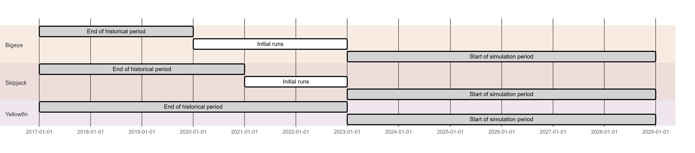{#fig-time}

#### Observation error model

Autocorrelation in CPUE residuals were introduced in the historical and simulation periods for all the Reference OMs based on the calculated autocorrelation coefficient at lag 1 (@fig-oem).

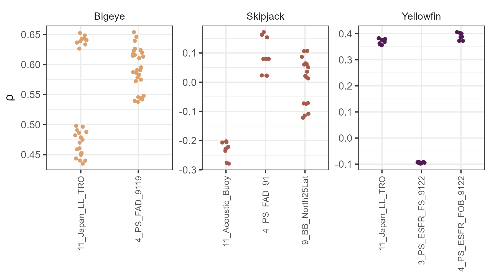{#fig-oem}

## Candidate Management Procedures

The management advice is given every three years (*management period*) and the total allowable catch (TAC) is derived from the candidate MP. The candidate MP was run in the last year of each management period, including information up to the previous year. The TAC derived from the MP was set for the next management period (@fig-timeline).

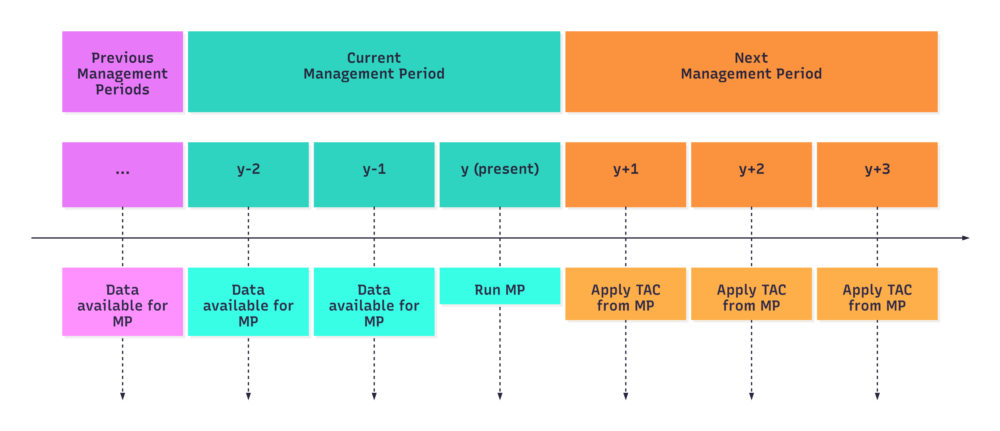{#fig-timeline}

### Pseudo-constant catch {#sec-mp-pcc}

The total allowable catch (TAC) for the next management period ($t+1$) is assumed constant, unless a reference value ($I_{G}$) derived from a group of indices of abundance in the last two years falls below a reference value $I_{ref}$:

$$TAC_{t+1} =
\begin{cases}
TAC_{ct}, & \text{if }I_{G} \geq I_{ref} \\
TAC_{ct}(\frac{I_{G}}{I_{ref}}), & \text{if }I_{G} < I_{ref}
\end{cases}$$

$I_{G}$ was calculated using index of abundance information ($I$) from the previous two years ($y-1$ and $y-2$):

$$I_G = \frac{I_{y-1}+I_{y-2}}{2}$$

In addition, the TAC variation between consecutive management periods $TAC_{t+1}$ and $TAC_{t}$ could not exceed 5% when $I_G < I_{ref}$.

@fig-pcc shows a representation of this HCR and @tbl-par-pcc shows the HCR parameters used for each stock.

| Stock | $I_{ref}$ | $TAC_{ct}$ | Index ($I$) |
|-------|--------|--------|--------|
| YFT | 0.6 | 120,000 | Joint longline |
| BET | 0.8 | 75,000 | Joint longline |
| SKJ | 0.7 | 220,000 | Acoustic buoy |

: HCR parameters for pseudo-constant catch MP. {#tbl-par-pcc}

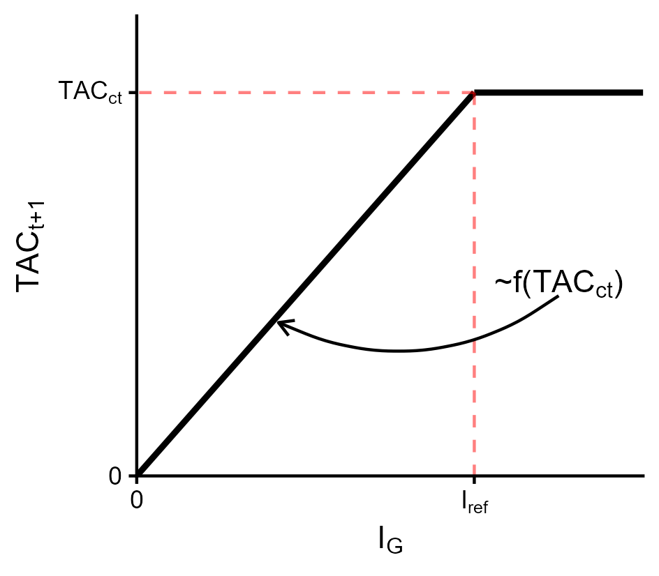{#fig-pcc width="55%"}

### Index-based

TAC for the next management period $t+1$ is calculated as a function of the current TAC ($TAC_{t}$):

$$TAC_{t+1} =
\begin{cases}
TAC_{t}, & \text{if }(1-\alpha)I_{ref} \leq I_{G} \leq (1+\alpha)I_{ref} \\
(1+\beta)TAC_{t}, & \text{if }I_{G} > (1+\alpha)I_{ref} \\
(1-\beta)TAC_{t}, & \text{if }I_{G} < (1-\alpha)I_{ref}
\end{cases}$$

$I_{G}$ was calculated as specified in @sec-mp-pcc. In addition, $TAC_{t} = TAC_{max}$ when $TAC_{t} > TAC_{max}$.

@fig-ibased shows a representation of this HCR and @tbl-par-ibased shows the HCR parameters used for each stock.

| Stock | $I_{ref}$ | $TAC_{max}$ | $\alpha$ | $\beta$ | 
|-------|--------|--------|--------|--------|
| YFT | 0.75 | 140,000 | 0.05 | 0.15 |
| BET | 0.8 | 80,000 | 0.05 | 0.1 |
| SKJ | 0.85 | 240,000 | 0.05 | 0.05 |

: HCR parameters for index-based MP. {#tbl-par-ibased}

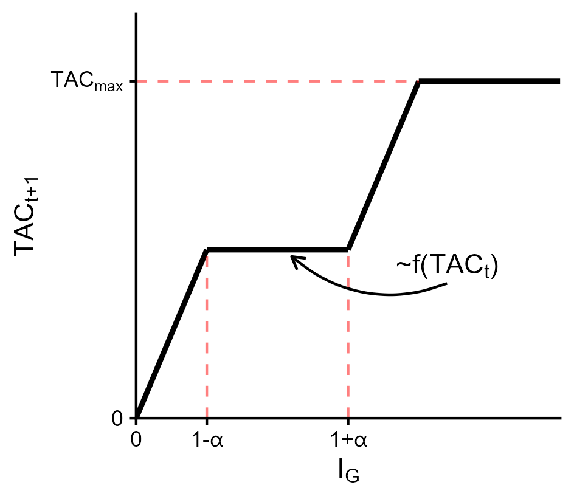{#fig-ibased width="55%"}

### Model-based

Simulated data was included in a stochastic surplus production model in continuous time (SPiCT). SPiCT is a full state-space model, where biomass and fishing dynamics are modelled as states, which are observed indirectly through biomass indices and commercial catches sampled with error [@pedersenStochasticSurplusProduction2017]. SPiCT calculates maximum sustainable yield (MSY) reference points and is able to make short-term projections. SPiCT is the estimation method in the MSE.

Data included in SPiCT were simulated catches and indices of abundance as shown in @tbl-par-pcc. In addition to the acoustic buoy index, SKJ SPiCT models also included a purse seine FAD index derived from catch and effort information.

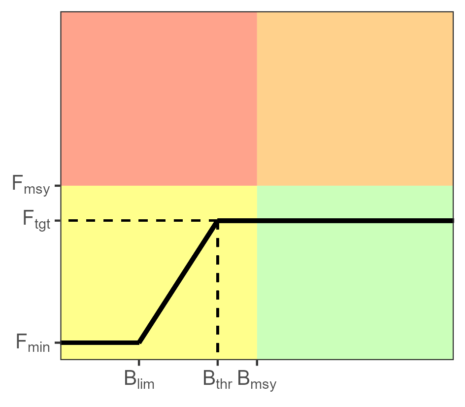{#fig-hcr width="50%"}

TAC is derived from a harvest control rule based on stock status estimate (@fig-hcr). In the HCR, $F_{tgt}$ and $B_{thr}$ need to be defined, and the following options were tested (@fig-hcr-combs):

- $F_{tgt}=0.8F_{msy}$ and $B_{thr}=B_{msy}$
- $F_{tgt}=0.9F_{msy}$ and $B_{thr}=B_{msy}$
- $F_{tgt}=F_{msy}$ and $B_{thr}=B_{msy}$

In addition, $B_{lim}=0.4\times B_{msy}$ and $F_{mim}=0.1\times F_{msy}$ for all cases. A maximum TAC restriction ($TAC_{max}$) could also be applied in some scenarios (@tbl-par-mbased). TAC variation between consecutive management periods $TAC_{t+1}$ and $TAC_{t}$ could not exceed 15%.

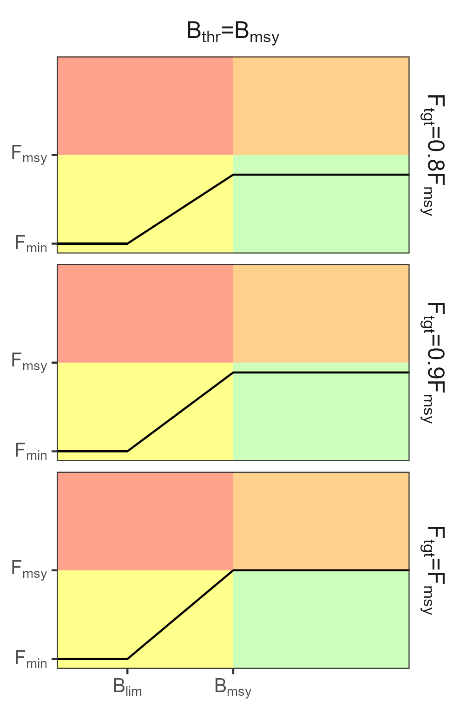{#fig-hcr-combs width="60%"}

| Stock | $TAC_{max}$ |
|-------|--------|
| YFT | 134,000 |
| BET | 95,000 |
| SKJ | 240,000 |

: Maximum TAC restriction applied in some model-based MPs. {#tbl-par-mbased}

## Catch Derivation

### Single-Stock Approach 

Just for exploration purposes, three single-stock MSEs were run independently (@fig-hcr-single). Note that this approach ignores any type of interaction among stocks, potentially achieving maximum sustainable yields for the three stocks simultaneously.

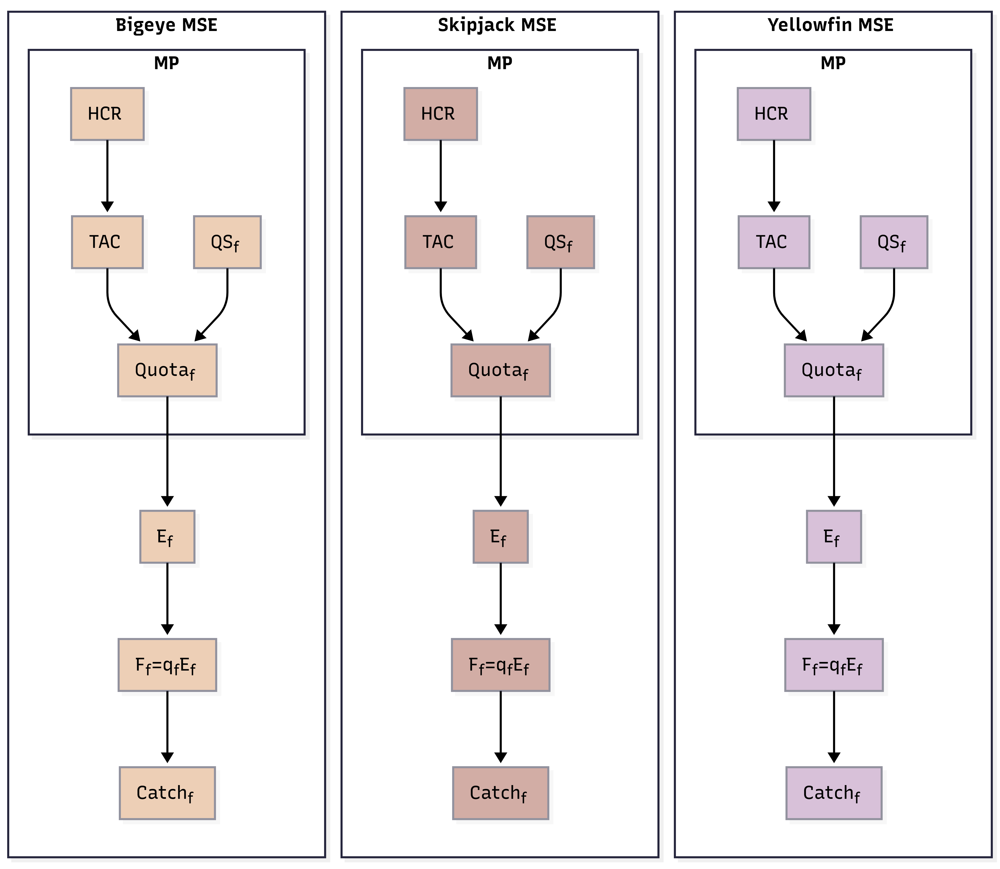{#fig-hcr-single}

### Multi-Stock Approach

In a multi-stock framework, stock-specific advice can be conflicting when different stocks are caught within the same fishery. In most cases, in order to not exceed the TAC of one stock (*choke stock or species*), the catch of the other two stocks may be lower than their TAC. Two approaches were tested to calculate the catch for the three stocks: minimum and mixed effort. In both cases, the *FcubEcon* methodology [@hoffEconomicEffortManagement2010] was used to calculate fishing mortality ($F$) and catch.

#### Minimum Effort

The annual management advice was produced based on the minimum effort among the three stocks (@fig-hcr-Emin).

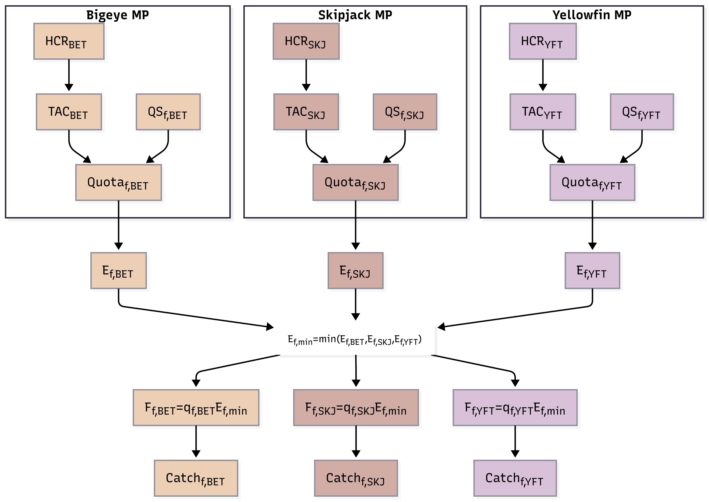{#fig-hcr-Emin}

#### Mixed Effort

The annual management advice was produced based on a mixed effort, following the *FcubEcon* approach [@hoffEconomicEffortManagement2010], among the three stocks. A summary of these steps is shown in @fig-hcr-Emix.

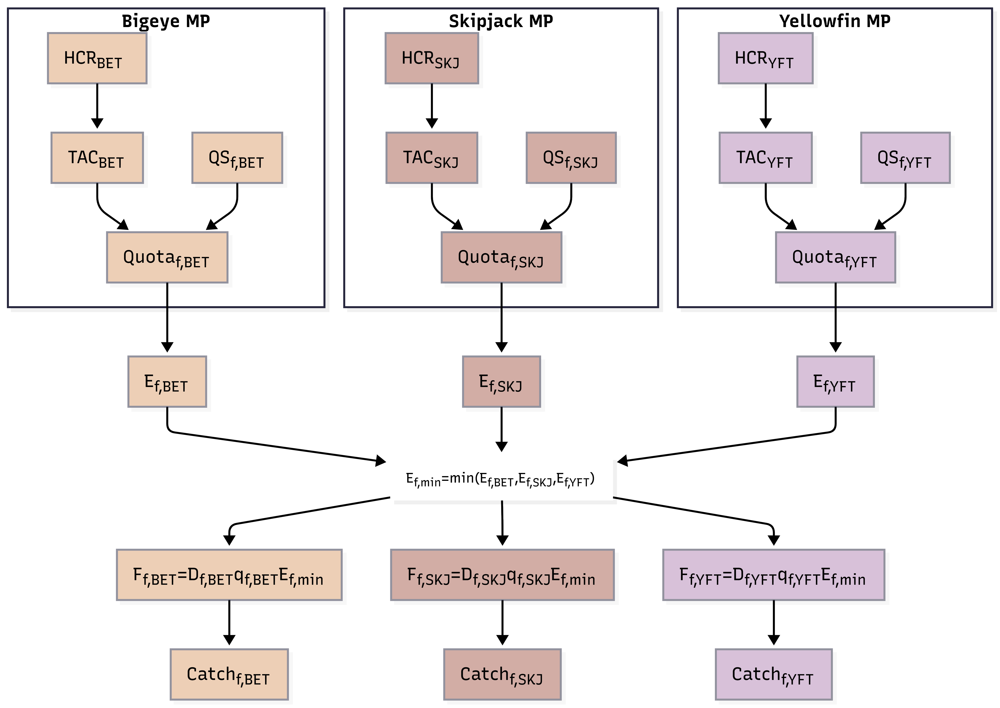{#fig-hcr-Emix}

In this case, $D_{f,STOCK}$ is calculated as:

$$D_{f,STOCK} = \frac{1+\frac{E_{f,STOCK}}{E_{f,min}}}{2}$$

Note that $D_{f,STOCK}\geq 1$, where $D_{f,STOCK}=1$ for the *choke* stock and $D_{f,STOCK}>1$ for the other two stocks.

## Performance Metrics

18 PMs have been developed for the TT MSE (@tbl-pm) and are grouped into four types: 

- **Status**: metrics related to stock status 

- **Safety**: metrics related to the probability of the stock not falling below the biological reference points

- **Yield**: metrics related to the catch in the projection years

- **Stability**: metrics related to the variation in the catches or TAC between management cycles

Each PM was calculated for every Reference OM. Examples of each PM is given below.

| Type | Metric | Symbol | Description |
|-----------------|-------------------|-----------------|-------------------|
| Status | Minimum spawner biomass relative to $B_{msy}$ | $minB$ | Minimum $B/B_{msy}$ value |
| Status | Mean spawner biomass relative to $B_{msy}$ | $meanB$ | Geometric mean of $B/B_{msy}$ |
| Status | Mean fishing mortality relative to $F_{msy}$ | $meanF$ | Geometric mean of $F/F_{msy}$ |
| Status | Probability (%) of being in the Kobe green quadrant | $PGK$ | Proportion of years in green quadrant (see @fig-hcr) |
| Status | Probability (%) of being in the Kobe red quadrant | $PRK$ | Proportion of years in red quadrant (see @fig-hcr) |
| Safety | Probability (%) of $B>B_{lim}$ | $PBlim$ | Proportion of years that $B>B_{lim}$ |
| Safety | Probability (%) of $B_{lim}<B<B_{msy}$ | $PBmsy$ | Proportion of years that $B_{lim}<B<B_{msy}$ |
| Yield | Mean catch (short term) | $Csrt$ | Mean catch from 1 to 3 years |
| Yield | Mean catch (medium term) | $Cmed$ | Mean catch from 5 to 10 years |
| Yield | Mean catch (long term) | $Clon$ | Mean catch from 15 to 25 years |
| Yield | Mean TAC (short term) | $Tsrt$ | Mean TAC from 1 to 3 years |
| Yield | Mean TAC (medium term) | $Tmed$ | Mean TAC from 5 to 10 years |
| Yield | Mean TAC (long term) | $Tlon$ | Mean TAC from 15 to 25 years |
| Yield | Mean TAC uptake | $Tupt$ | Mean of caught TAC (%) over years |
| Stability | Mean absolute proportional change (%) in TAC | $Tc$ | Mean of $\mid\frac{TAC_t - TAC_{t-1}}{TAC_{t-1}}\mid$ |
| Stability | Standard deviation in TAC | $Tsd$ | TAC standard deviation |
| Stability | Probability (%) of TAC change over a certain level | $PTcx$ | Proportion of management cycles when the ratio of change $\frac{TAC_y - TAC_{y-1}}{TAC_{y-1}} > 10\%$ |
| Stability | Maximum amount of TAC change (%) between management periods | $Tcmax$ | Maximum ratio of TAC change |

: Performance metrics and description. {#tbl-pm}

### Examples

#### Status

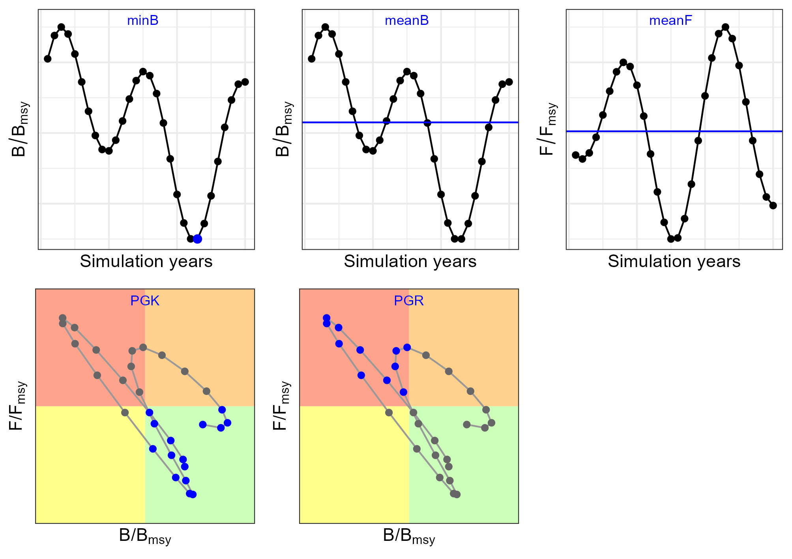{#fig-pm-status}

#### Safety

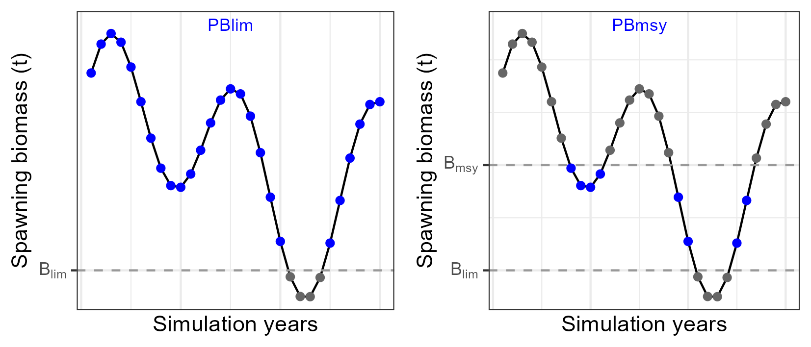{#fig-pm-safety width="75%"}

#### Yield

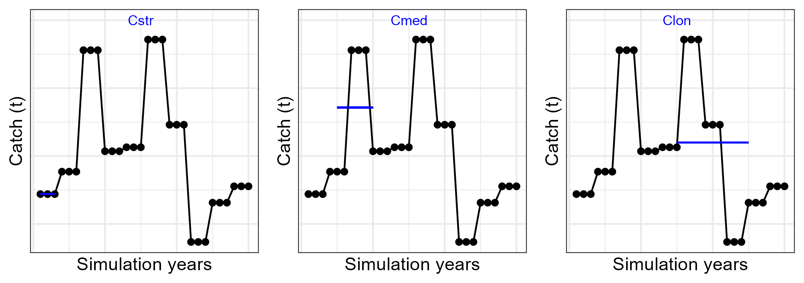{#fig-pm-yield}

#### Stability

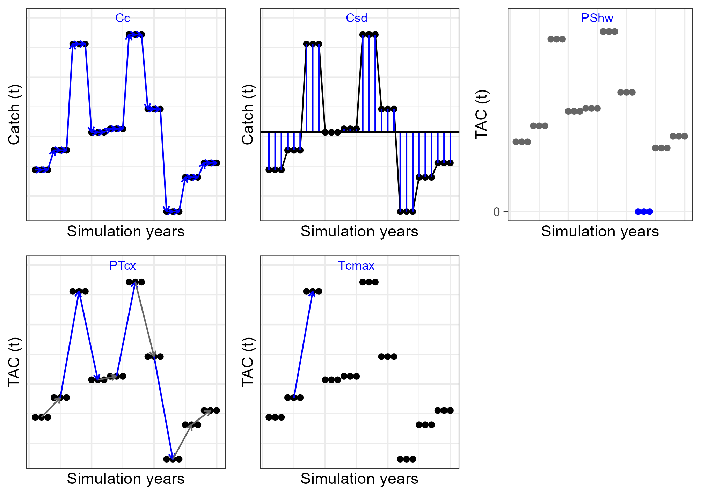{#fig-pm-stability}

## Glossary

| Term   | Definition        |
|--------|-------------------|
| TT     | Tropical tunas   |
| BET     | Bigeye   |
| SKJ     | Skipjack   |
| YFT     | Yellowfin   |
| OM     | Operating model   |
| CMP    | Candidate management procedure   |
| PM     | Performance metric   |
| TTSG  | Tropical Tunas Species Group   |
| SS3  | Stock Synthesis 3 platform   |
| ESS  | Effective sample size   |
| M  | Natural mortality   |
| sigmaR  | Variability in recruitment   |
| h  | Steepness in the stock-recruit function   |
| OEM  | Observation error model   |
| HCR  | Harvest control rule   |
| TAC  | Total Allowable Catch  |

## References {.unnumbered}
